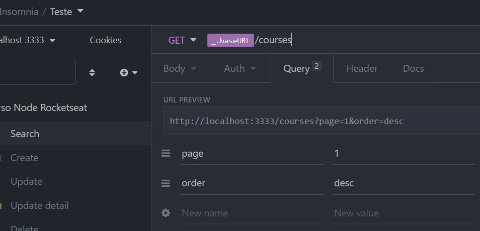

# Node.js

* Ryan Dahl - Barra de progresso flickr - suporte I/O assíncrono

* V8 + libuv + conjunto de módulos

* É um ambiente de execução para o javascript , e permite sua execução do lado do servidor.
  
* Node é guiado por eventos - Event Driven : Fluxo de controle determinado por eventos ou alterações de estados - Acontece algo e em seguida tem o resultado

* Arquitetura Event loop - A maioria das implementações possuem um core (central) que escuta todos os eventos e chama seusrespectivos callbacks quando eles são lançados (ou têm seu estado alterado)
    * Call Stack - Pilha de funções que vão ser chamadas, " o que entra por último sai primeiro"
    * Non-blocking I/O - não precisa que a função termine por completo para que a outra seja executada
    * Módulos Próprios : http - dns - fs - buffer - ...
  
    
  
    

`Single-threaded*, non-blocking e asynchronous`

[*ver mais aqui sobre single-threaded](https://betterprogramming.pub/is-node-js-really-single-threaded-7ea59bcc8d64)

## V8 

É o Engine (open source) de javascript e WebAssembly de alto desempenho do google, pode ser usado no Chrome ou ambientes similares, mas não é dependente do navegador, pode ser executado de forma independente e incorporado a qualquer aplicativo C ++ - Linguagem pela qual é escrito.

[ver mais aqui:](https://imasters.com.br/front-end/node-js-o-que-e-esse-event-loop-afinal)

## Libuv

 A libuv é uma biblioteca open source multiplataforma escrita em C, criada inicialmente para o Node.js. Hoje ela é usada por diversos sistemas

 ## Event Loop 

 `Single thred`; fica escutando as requisições da Call Stack, e manda pras threds, por padrão vai ter 4 threds disponíveis para serem executadas, pode ser adaptado conforme disponibilidade.

 ## Gerenciadores de pacotes

 * NPM e Yarn(+ rápido)
 * Instalar bibliotecas externas : Token , Hash, libs externas
 * Disponibilizar bibliotecas

## Frameworks

* Express
* Egg.js
* Nest.js
* Adonis.js

## API REST 
* Boa documentação ,identificação recursos, rotas claras, mensagens auto-descritivas!
* HATEOAS - (Hypertext As The Engine Of Application State) - retorno de links
* Status Code - Foco 2xx - 4xx - 5xx

  

## Métodos 
* Get - Buscar uma informação dentro do servidor 
* Post - Inserir uma informação no servidor
* Put - Altera a informação no servidor (corpo)
* Patch - Alterar somente parte da informação
* Delete - Deletar informação no servidor

`*Requisições via URL do browser são sempre GET`

## Parâmetros das Requisições:
Header params :
API Key, token , o resto a biblioteca geralmente preenche

## Body Params
Os objetos para inserção/alteração de algum recursos; cadastro ou update de recursos

## Query Params
Parâmetros esperados para ser recebido. Servem para buscar, editar ou deletar um recurso.
Ex: "/courses/:`id`"
Paginação, filtro de busca...

  

  

## Route Params
Parâmetros que vamos receber encapsulados na nossa rota.
!! SE NÃO PASSADO NA ROTA ELE DÁ ERRO NA APLICAÇÃO !!

## Boas Práticas
* A Utilização correta dos métodos HTTP
* A utilização correta dos status no retorno das Respostas
* Padrãos de nomeclatura 

  

## Iniciando a contrução do projeto:

 
 ´*ctrl + shift + p > install code´

 ## Package.json
 Concentra as informações das dependências que instalamos no projeto , scripts pra rodar a aplicação...

## Express 
Microfrawork - auxilia a criação e gerenciamento das rotas - servidor - middlewares

## Nodemon 
Ferramenta que monitora o meu arquivo de código e toda vez que tem alteração nele ele reinicia o processo do node - Reload - de forma que as alterações reflitam no cliente que estiver chamando a aplicação
 * Instalar como dependência de desenvolvimento : $ yarn add nodemon -D

 * Adicionar script ao package.json : "scripts": { "dev": "nodemon scr/index.js" }
  
  
  
  

  ## Insomnia 
  Ferramenta que ajuda a testar requisições e visualizar as respostas da tua API.

  ## Middleware 
  Função que fica entre o request e o response - Em alguns casos tem algumas que executam antes da request/response.
  Usado para fazer validação de token, verificar se o usuário que está fazendo a solicitação é admin ou não

  * Como defino que minha função vai ser middleware?
  * recebe o request, o response e o next(define se o middle prossegue com a operação ou se ele para aonde está - fluxo)
  * Se colocar dentro da rota(URL) só a rota que eu especificar usa o Middleware 
  * Se eu usar o app.use todas as rotas abaixo usarão o Middleware definido